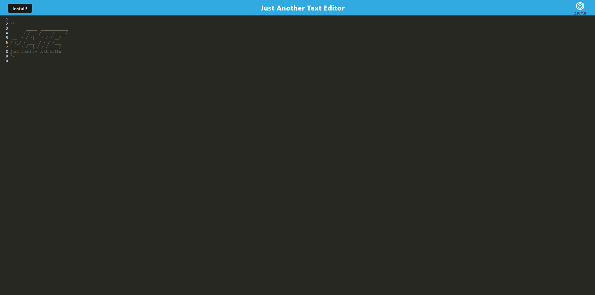

# Progressive Text Editor

## User Story

```md
AS A developer
I WANT to create notes or code snippets with or without an internet connection
SO THAT I can reliably retrieve them for later use
```

## Acceptance Criteria

```md
GIVEN a text editor web application
WHEN I open my application in my editor
THEN I should see a client server folder structure
WHEN I run `npm run start` from the root directory
THEN I find that my application should start up the backend and serve the client
WHEN I run the text editor application from my terminal
THEN I find that my JavaScript files have been bundled using webpack
WHEN I run my webpack plugins
THEN I find that I have a generated HTML file, service worker, and a manifest file
WHEN I use next-gen JavaScript in my application
THEN I find that the text editor still functions in the browser without errors
WHEN I open the text editor
THEN I find that IndexedDB has immediately created a database storage
WHEN I enter content and subsequently click off of the DOM window
THEN I find that the content in the text editor has been saved with IndexedDB
WHEN I reopen the text editor after closing it
THEN I find that the content in the text editor has been retrieved from our IndexedDB
WHEN I click on the Install button
THEN I download my web application as an icon on my desktop
WHEN I load my web application
THEN I should have a registered service worker using workbox
WHEN I register a service worker
THEN I should have my static assets pre cached upon loading along with subsequent pages and static assets
WHEN I deploy to Heroku
THEN I should have proper build scripts for a webpack application
```

## Description

This project consists in a Progressive Text Editor that will allows us to use it as a tex editor and save information.This project contains 9 JavaScript files, 1 CSS file and 1 Index.html file.

There was no major challenges for me during this project since most of the code missing was in previous activitys that were done in the class , so getting the code and then adjusting it was pretty simple.

This challenge helped me a lot because it made my understanding of Progressive Apps higher and also made more confident while using webpack and new technologies that i barelly used before. There was more stuff that this challenge helped me with that i will be listing bellow.

- Better use of lighthouse
- Higher understanding of using DevTools
- Higher understanding of progressive apps

## Table of Contents

- [Installation](#installation)
- [Usage](#usage)
- [Tests](#tests)
- [License](#license)
- [Questions](#questions)

## Installation

To install the necessary dependencies, run the following command:

```
npm i
```

## Usage

To use this repository is pretty simple. You will have to clone the repo , and soon as you clone it and open it, you will need to open your terminal and run the following command (npm i). After installing everything you will need to run this following command in your terminal run (npm run start:dev). After running this command you will see your localhost was made and you should be able to access your localhost and your editor in browser. Or you can use the heroku deployed application instead of the localhost.



Deployed Application: https://progressive-text-edit-1ab400654b8a.herokuapp.com/

## Tests

I will be listing the tests i have done.

```
Tested - Checking IndexDB to see information
Tested - Checking Manifest
Tested - Checking Service Worker
Tested - Checking typing in the text editor
```

## License


This project is licensed under the MIT license.

## Questions

For any questions or inquiries, feel free to reach out to me:

- GitHub: [DiogoS77](https://github.com/DiogoS77)
- Email: diogo.messi.18@hotmail.com

Deployed Application: https://progressive-text-edit-1ab400654b8a.herokuapp.com/
